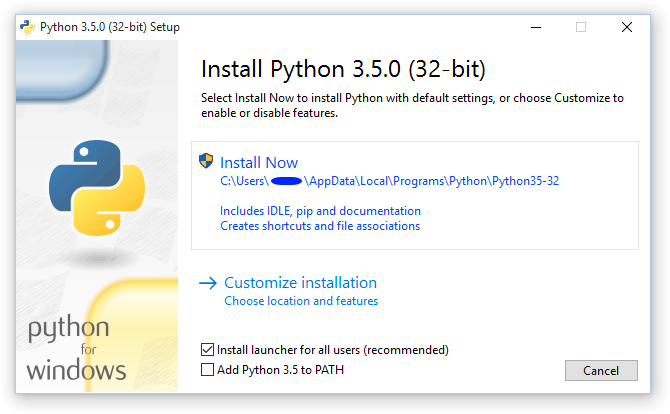

# Strike (With) A Pose

<p align="center">

</p>

This is the companion tool to the paper:

> [Michael A. Alcorn](https://sites.google.com/view/michaelaalcorn), Qi Li, Zhitao Gong, Chengfei Wang, Long Mai, Wei-Shinn Ku, and [Anh Nguyen](http://anhnguyen.me). [Strike (with) a pose: Neural networks are easily fooled by strange poses of familiar objects](https://arxiv.org/abs/1811.11553). arXiv 1811.11553. 2018.

 The tool allows you to generate adversarial poses of objects with a graphical user interface. Please note that the included jeep object (freely available [here](https://free3d.com/3d-model/jeep-10771.html)) does not meet the realism standards set in the paper. Unfortunately, the school bus object shown in the GIF is proprietary and cannot be distributed with the tool. A web port of the tool (created by [Zhitao Gong](https://github.com/gongzhitaao)) can be found [here](https://airalcorn2.github.io/strike-with-a-pose/).

 If you use this tool for your own research, please cite:

```
@article{alcorn-2018-strike-with-a-pose,
    Author = {Alcorn, Michael A. and Li, Qi and Gong, Zhitao and Wang, Chengfei and Mai, Long and Ku, Wei-Shinn and Nguyen, Anh},
    Title = {{Strike (with) a Pose: Neural Networks Are Easily Fooled by Strange Poses of Familiar Objects}},
    Journal = {arXiv preprint},
    Year = {2018}
}
```

## Requirements

* [**Git**](https://git-scm.com/book/en/v2/Getting-Started-Installing-Git) (Linux users only)
* **OpenGL** &ge; 3.3 (many computers satisfy this requirement)
  * On Linux, you can check your OpenGL version with the following command (requires `glx-utils` on Fedora or `mesa-utils` on Ubuntu):
  ```bash
  glxinfo | grep "OpenGL version"
  ```
  * On Windows, you can use [this tool](https://community.esri.com/groups/technical-support/blog/2012/03/15/what-version-of-opengl-do-i-have-and-do-i-have-the-latest-drivers-for-my-system).
* **Python 3** ([Mac](https://www.python.org/ftp/python/3.6.7/python-3.6.7-macosx10.9.pkg), [Windows](https://www.python.org/ftp/python/3.6.7/python-3.6.7-amd64.exe))
  * **Mac** users might also have to [install SSL certificates for Python](https://stackoverflow.com/a/42334357/1316276) by double-clicking the file found at:
  ```bash
  /Applications/Python\ 3.x/Install\ Certificates.command
  ```
  where `x` is the minor version of your particular Python 3 install. If you used the above link to install Python, the file will be at:
  ```bash
  /Applications/Python\ 3.6/Install\ Certificates.command
  ```
  * **Windows** users should make sure they [select the option to "Add Python 3.x to PATH"](https://docs.python.org/3/using/windows.html#installation-steps) where "x" is the minor version of the Python 3 you are installing. If you forget to select this option, you can also [add Python to the PATH yourself](https://projects.raspberrypi.org/en/projects/using-pip-on-windows/5).
  

## Install/Run

Note: the tool takes a little while to start the first time it's run because it has to download the neural network.

### Linux

In the terminal, enter the following commands:

```bash
# Clone the strike-with-a-pose repository.
git clone https://github.com/airalcorn2/strike-with-a-pose.git
# Move to the strike-with-a-pose directory.
cd strike-with-a-pose
# Install strike-with-a-pose.
pip3 install .
# Run strike-with-a-pose.
strike-with-a-pose
```

You can also run the tool (after installing) by starting Python and entering the following:

```python
from strike_with_a_pose import app
app.run_gui()
```

### Mac

1. Click [here](https://github.com/airalcorn2/strike-with-a-pose/archive/master.zip) to download the tool ZIP.
2. Extract the ZIP somewhere convenient (like your desktop).
3. Double-click `install.command` in the `strike-with-a-pose-master/` directory.
  * Note: you may have to [adjust your security settings](https://www.mcvsd.org/tips/powerteacher/osx_unidentified_developers.html) to allow applications from "unidentified developers".
4. Double-click `strike-with-a-pose.command` in the `strike-with-a-pose-master/run/` directory.

### Windows

1. Click [here](https://github.com/airalcorn2/strike-with-a-pose/archive/master.zip) to download the tool ZIP.
2. Extract the ZIP somewhere convenient (like your desktop).
3. Double-click `install.bat` in the `strike-with-a-pose-master\` directory.
 * Note: you may need to click "More info" and then "Run anyway".
4. Double-click `strike-with-a-pose.bat` in the `strike-with-a-pose-master\run\` directory.

## For Experts

### Using Different Objects and Backgrounds

Users can test their own objects and backgrounds in `strike-with-a-pose` by ***(1)*** adding the appropriate files to the `scene_files/` directory,  ***(2)*** modifying the `BACKGROUND_F`, `TEXTURE_FS`, and `OBJ_FS` variables in  [`settings.py`](https://github.com/airalcorn2/strike-with-a-pose/blob/master/strike_with_a_pose/settings.py) accordingly, and ***(3)*** running the following command inside the `strike-with-a-pose/` directory:

```bash
PYTHONPATH=strike_with_a_pose python3 -m strike_with_a_pose.app
```

### Using Different Machine Learning Models

Users can experiment with different machine learning models in `strike-with-a-pose` by ***(1)*** defining a model class that implements the `get_gui_comps`, `init_scene_comps`, `predict`, `render`, and `clear` functions (see [`Classifier.py`](https://github.com/airalcorn2/strike-with-a-pose/blob/master/strike_with_a_pose/Classifier.py) and [`ObjectDetector.py`](https://github.com/airalcorn2/strike-with-a-pose/blob/master/strike_with_a_pose/ObjectDetector.py) for examples), ***(2)*** setting the `MODEL` variable in [`settings.py`](https://github.com/airalcorn2/strike-with-a-pose/blob/master/strike_with_a_pose/settings.py) accordingly, and ***(3)*** running the following command inside the `strike-with-a-pose/` directory:

```bash
PYTHONPATH=strike_with_a_pose python3 -m strike_with_a_pose.app
```

### Additional Modes

Pressing **L** will toggle **Live** mode. When on, the neural network will continuously generate predictions. Note, **Live** mode can cause considerable lag if you do not have each of ***(1)*** a powerful GPU, ***(2)*** [CUDA](https://developer.nvidia.com/cuda-90-download-archive) installed, and ***(3)*** a [PyTorch version with CUDA](https://pytorch.org/get-started/locally/) support installed.

Pressing **X** will toggle the object's **teXture**. This is useful for making sure the directional light is properly interacting with your object. If the light looks funny, swapping/negating the vertex normal coordinates can usually fix it. See the script below for an example.

```python
input_f = "frame.obj"
output_f = "frame_new.obj"

lines = open(input_f).read().strip().split("\n")
out = open(output_f, "w")
for line in lines:
    if line[:2] == "vn":
        parts = line.split()
        # Play around with this line.
        (parts[2], parts[3]) = (parts[3], str(-float(parts[2])))
        line = " ".join(parts)

    print(line, file=out)

out.close()
```
